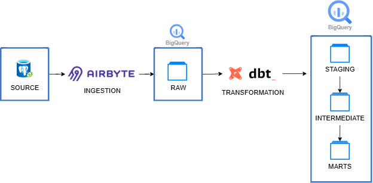
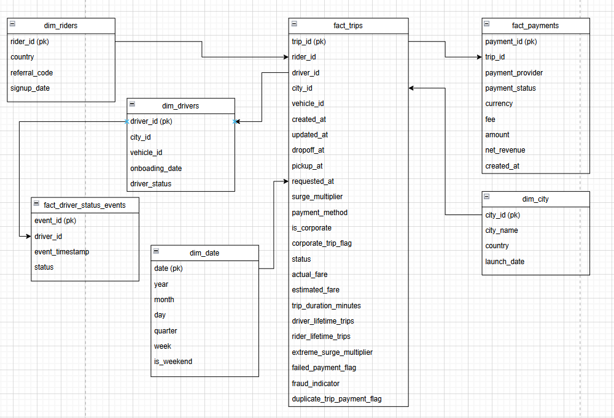
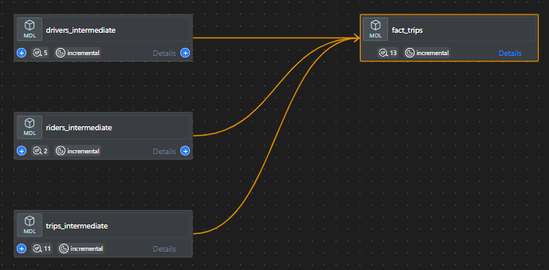
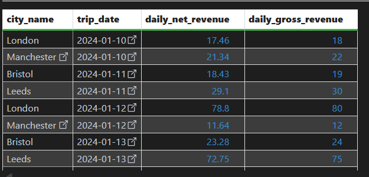
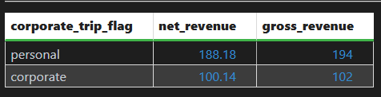
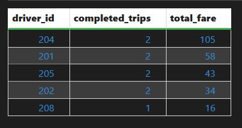
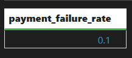
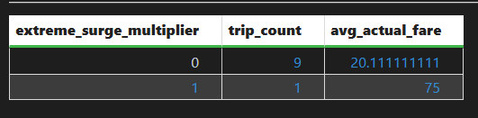
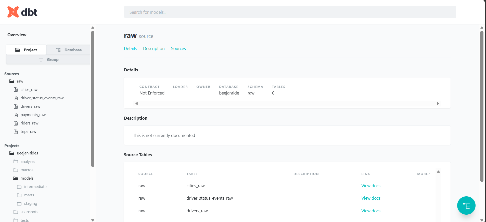
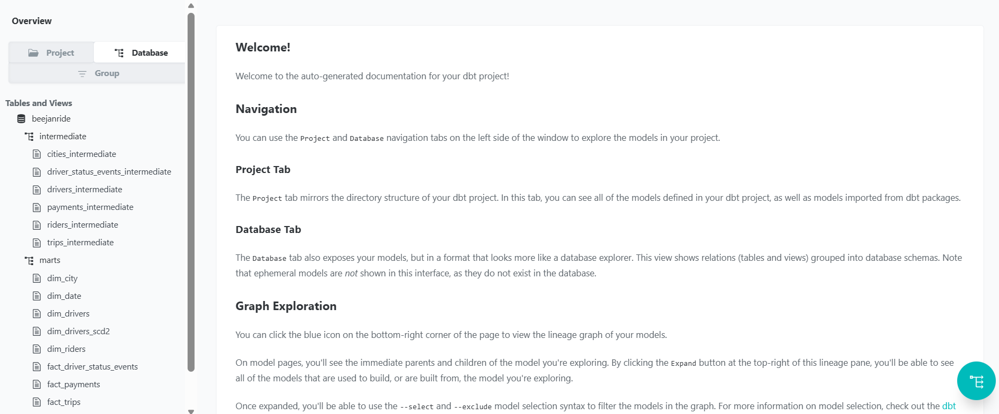

# BeejanRides Analytics Platform with dbt

## Project Overview

BeejanRides is a UK mobility startup operating across five cities and offering ride-hailing, airport transfers, and scheduled corporate rides. This project implements the transformation layer of a modern analytics stack using **Airbyte**, **BigQuery**, and **dbt Core**.

The goal of the project is to transform raw transactional data from the operational system into a **production-oriented analytics layer** that is testable, documented, scalable, and structured for business reporting.

This dbt project supports the following analytical use cases:

* Daily revenue per city
* Gross vs net revenue analysis
* Corporate vs personal trip analysis
* Top drivers by activity and revenue contribution
* Rider lifetime value analysis
* Payment reliability and failed payment monitoring
* Surge pricing impact analysis
* Driver activity monitoring
* Fraud detection signals

---

## Architecture



### Layered Modeling Approach

This project follows a layered dbt architecture:

* **Raw**: Immutable tables replicated from Postgres via Airbyte
* **Staging**: Light cleaning, type casting, and standardization from source tables
* **Intermediate**: Reusable business logic and calculated fields
* **Marts**: Analytics-ready fact and dimension models in a star-schema style

---

## Tech Stack

* **Ingestion:** Airbyte
* **Warehouse:** BigQuery
* **Transformation:** dbt Core
* **Version Control:** Git & GitHub
* **Packages:** dbt-labs/codegen, dbt-labs/dbt_utils

---

## Repository Structure

```text
BeejanRides/
├── analyses/
│   ├── daily_revenue_per_city.sql
│   ├── corporate_vs_personal_revenue_split.sql
│   ├── top_drivers_by_completed_trips.sql
│   ├── payment_failure_rate.sql
│   ├── surge_impact_analysis.sql
│   └── fraud_monitoring.sql
├── macros/
│   ├── generate_schema_name.sql
│   └── subtraction.sql
├── models/
│   ├── source/
│   │   └── _sources.yml
│   ├── staging/
│   │   ├── cities_staging.sql
│   │   ├── driver_status_events_staging.sql
│   │   ├── drivers_staging.sql
│   │   ├── payments_staging.sql
│   │   ├── riders_staging.sql
│   │   ├── trips_staging.sql
│   │   └── schema.yml
│   ├── intermediate/
│   │   ├── cities_intermediate.sql
│   │   ├── driver_status_events_intermediate.sql
│   │   ├── drivers_intermediate.sql
│   │   ├── payments_intermediate.sql
│   │   ├── riders_intermediate.sql
│   │   ├── trips_intermediate.sql
│   │   └── schema.yml
│   └── marts/
│       ├── dim/
│       │   ├── dim_city.sql
│       │   ├── dim_date.sql
│       │   ├── dim_drivers.sql
│       │   ├── dim_riders.sql
│       │   └── schema.yml
│       └── facts/
│           ├── fact_driver_status_events.sql
│           ├── fact_payments.sql
│           ├── fact_trips.sql
│           └── schema.yml
├── snapshots/
│   └── drivers.yml
├── tests/
│   ├── completed_trips_and_successful_payment.sql
│   ├── no_negative_revenue.sql
│   └── trip_duration_not_less_than_zero.sql
├── dbt_project.yml
├── packages.yml
└── README.md
```

---

## Source Data

The project models six raw source tables replicated from Postgres:

* `cities_raw`
* `driver_status_events_raw`
* `drivers_raw`
* `payments_raw`
* `riders_raw`
* `trips_raw`

### Source Governance

Source configuration is defined in `models/source/_sources.yml`.

Implemented in the project:

* source registration for all six raw tables
* freshness monitoring on `trips_raw`
* `loaded_at_field: created_at`
* `warn_after: 2 hours`

This supports the requirement that trip data should be monitored for ingestion freshness.

---

## Staging Layer

The staging layer standardizes raw source data into cleaner and more analysis-friendly tables.

### Implemented staging models

* `cities_staging`
* `driver_status_events_staging`
* `drivers_staging`
* `payments_staging`
* `riders_staging`
* `trips_staging`

### What happens in staging

Across the staging models, the following transformations are applied:

* selection of relevant columns from raw tables
* timestamp standardization using `CAST(... AS TIMESTAMP)`
* preservation of source grain
* schema testing for primary keys and accepted values

### Examples

* `cities_staging` standardizes `launch_date`
* `drivers_staging` standardizes `onboarding_date`, `created_at`, and `updated_at`
* `payments_staging` standardizes payment timestamps
* `trips_staging` standardizes ride lifecycle timestamps such as `requested_at`, `pickup_at`, and `dropoff_at`

---

## Intermediate Layer

The intermediate layer contains reusable business transformations and derived metrics.

### Implemented intermediate models

* `cities_intermediate`
* `driver_status_events_intermediate`
* `drivers_intermediate`
* `payments_intermediate`
* `riders_intermediate`
* `trips_intermediate`

### Key business logic implemented

#### 1. Trip duration

`trips_intermediate` calculates:

* `trip_duration_minutes`

#### 2. Corporate trip classification

`trips_intermediate` derives:

* `corporate_trip_flag` = `corporate` or `personal`

#### 3. Extreme surge logic

`trips_intermediate` derives:

* `extreme_surge_multiplier`
* logic: `surge_multiplier > 10`

#### 4. Failed payment on completed trip

`trips_intermediate` derives:

* `failed_payment_flag`
* logic: completed trip with failed payment state

#### 5. Fraud indicator

`trips_intermediate` derives:

* `fraud_indicator`
* logic: cancelled trip with latest payment marked successful

#### 6. Duplicate successful trip payments

`trips_intermediate` derives:

* `duplicate_trip_payment_flag`
* logic: more than one successful payment for the same trip

#### 7. Driver lifetime trips

`drivers_intermediate` derives:

* `driver_lifetime_trips`
* logic: count of completed trips grouped by driver

#### 8. Rider lifetime value

`riders_intermediate` derives:

* `rider_lifetime_value`
* logic: sum of successful payment amount across a rider’s trips

#### 9. Net revenue calculation

`payments_intermediate` derives:

* `net_revenue`
* logic: `amount - fee`
* implemented using a reusable macro

---

## Macros

The project includes reusable macros under `macros/`.

### `subtraction.sql`

A reusable macro is used to calculate net revenue:

* `subtract(x, y, precision)`
* rounds the result to the supplied precision

This macro is used in `payments_intermediate` to derive `net_revenue`.

### `generate_schema_name.sql`

This macro customizes schema naming and keeps environment schema output controlled.

---

## Marts Layer

The marts layer provides analytics-ready models in a star-schema style.

### Dimensions

#### `dim_city`

**Grain:** one row per city
Contains city descriptors such as city name, country, and launch date.

#### `dim_drivers`

**Grain:** one row per driver
Contains descriptive driver attributes including city, vehicle, rating, status, onboarding date, and audit timestamps.

#### `dim_riders`

**Grain:** one row per rider
Contains descriptive rider attributes including country, referral code, signup date, and created timestamp.

#### `dim_date`

A reusable calendar dimension generated using `dbt_utils.date_spine` for date-based reporting.

### Facts

#### `fact_trips`

**Grain:** one row per trip
This is the primary business-process fact and includes:

* trip identifiers and operational foreign keys
* timestamps
* fare metrics
* trip duration
* corporate trip classification
* surge flags
* payment anomaly flags
* driver lifetime trips
* rider lifetime value

#### `fact_payments`

**Grain:** one row per payment
Captures payment-level measures including amount, fee, and net revenue.

#### `fact_driver_status_events`

**Grain:** one row per driver status event
Captures online/offline events for driver activity monitoring.

---

## Star Schema Summary

### Fact tables

* `fact_trips`
* `fact_payments`
* `fact_driver_status_events`

### Dimension tables

* `dim_city`
* `dim_drivers`
* `dim_riders`
* `dim_date`

This structure supports revenue analysis, trip operations analysis, rider value analysis, and driver event monitoring.

### ERD


### fact_trips LINEAGE


---

## Incremental Modeling Strategy

Most transformation models in this project are configured with `materialized='incremental'`.

### Why incremental models are useful here

Incremental models are appropriate because BeejanRides processes transactional and event data that will continue to grow over time. Rebuilding large ride, payment, and event tables on every run becomes expensive and slow as data volume increases.

### Benefits

* faster run times for large datasets
* lower warehouse compute cost
* more realistic production behavior for event-heavy tables such as driver status events

### Tradeoffs

#### Full refresh

Pros:

* simple logic
* easier to reason about
* always guarantees full recomputation

Cons:

* slower at scale
* more expensive
* not ideal for high-volume event data

#### Incremental

Pros:

* more scalable
* lower processing cost
* better aligned to production workloads

Cons:

* requires careful filtering strategy
* late arriving records need extra handling
* logic becomes more complex over time

In this project, incremental materialization is already applied broadly to staging, intermediate, and mart models to support scale as BeejanRide grows.

---

## Snapshots

The project includes snapshot logic for drivers in `snapshots/drivers.yml`.

### Snapshot objective

Track Slowly Changing Dimension Type 2 history for driver attributes that may change over time.

### Tracked attributes

* `driver_status`
* `vehicle_id`
* `rating`

### Snapshot strategy

* `strategy: check`
* `unique_key: driver_id`

This enables historical tracking of driver profile changes, which is important for auditability and change analysis.


---

## Data Quality and Testing

The project includes a mix of schema tests and singular data tests.

### Generic schema tests implemented

Across staging, intermediate, and marts layers, the project includes:

* `not_null`
* `unique`
* `accepted_values`

Examples:

* primary keys such as `trip_id`, `payment_id`, `driver_id`, and `event_id`
* accepted values for trip status, driver status, payment status, payment provider, and online/offline event status
* boolean validation for `is_corporate`
* binary validation for fraud and surge-related flags

### Custom singular tests implemented

#### `no_negative_revenue.sql`

Asserts that `net_revenue` in `fact_payments` is not negative.

#### `trip_duration_not_less_than_zero.sql`

Asserts that `trip_duration_minutes` in `fact_trips` is not negative.

#### `completed_trips_and_successful_payment.sql`

Asserts that completed trips do not carry a failed payment flag.

### Freshness testing

* `trips_raw` configured with freshness warning threshold of 2 hours


---

## Documentation

The project includes model and column descriptions in schema YAML files across:

* staging
* intermediate
* marts

This supports dbt docs generation and model discoverability.

### dbt documentation commands

```bash
dbt docs generate
dbt docs serve
```


---

## Design Decisions

### 1. Layered architecture

A raw → staging → intermediate → marts architecture was adopted to separate concerns clearly:

* staging for standardization
* intermediate for reusable business logic
* marts for consumption-ready analytics tables

### 2. Business logic centralized upstream

Instead of repeating metrics downstream in BI tools, important calculations such as trip duration, net revenue, lifetime metrics, and anomaly flags are modeled directly in dbt.

### 3. Fact and dimension separation

Trips, payments, and status events are modeled as facts because they occur at different grains and represent measurable business processes.

### 4. Reusable macro for revenue logic

The subtraction macro avoids hardcoding repeated revenue logic and improves maintainability.

### 5. Freshness on critical source data

Trip freshness was prioritized because trip data powers several key business KPIs.

---

## Sample Analytical Queries

### 1. Daily revenue per city

```sql
select
    c.city_name,
    date(t.created_at) as trip_date,
    sum(p.net_revenue) as daily_net_revenue,
    sum(p.amount) as daily_gross_revenue
from {{ ref('fact_payments') }} p
join {{ ref('fact_trips') }} t
    on p.trip_id = t.trip_id
join {{ ref('dim_city') }} c
    on t.city_id = c.city_id
group by 1, 2
order by 2, 1;
```


### 2. Corporate vs personal revenue split

```sql
select
    t.corporate_trip_flag,
    sum(p.net_revenue) as net_revenue,
    sum(p.amount) as gross_revenue
from {{ ref('fact_trips') }} t
join {{ ref('fact_payments') }} p
    on t.trip_id = p.trip_id
group by 1;
```



### 3. Top drivers by completed trips

```sql
select
    driver_id,
    count(*) as completed_trips,
    sum(actual_fare) as total_fare
from {{ ref('fact_trips') }}
where status = 'completed'
group by 1
order by completed_trips desc, total_fare desc
limit 10;
```



### 4. Payment failure rate

```sql
select
    round(
        sum(case when payment_status = 'failed' then 1 else 0 end)
        / count(*),
        4
    ) as payment_failure_rate
from {{ ref('fact_payments') }};
```


### 5. Surge impact analysis

```sql
select
    extreme_surge_multiplier,
    count(*) as trip_count,
    avg(actual_fare) as avg_actual_fare
from {{ ref('fact_trips') }}
group by 1;
```


### 6. Fraud monitoring

```sql
select
    trip_id,
    driver_id,
    rider_id,
    status,
    fraud_indicator,
    duplicate_trip_payment_flag,
    failed_payment_flag
from {{ ref('fact_trips') }}
where fraud_indicator = 1
   or duplicate_trip_payment_flag = 1
   or failed_payment_flag = 1;
```
### Generated docs and lineage graph





---

## How to Run the Project

### 1. Install dependencies

```bash
dbt deps
```

### 2. Run models

```bash
dbt run
```

### 3. Run tests

```bash
dbt test
```

### 4. Build everything in one command

```bash
dbt build
```

### 5. Generate docs

```bash
dbt docs generate
dbt docs serve
```

---

## What Stands Out in This Project

This project demonstrates several production-oriented data engineering practices:

* layered dbt architecture
* reusable macro for calculation logic
* source freshness monitoring
* custom data quality tests tied to business rules
* event-level and transaction-level fact modeling
* snapshot scaffolding for SCD Type 2 tracking
* incremental materialization strategy across the pipeline
* documentation coverage at model and column level

It goes beyond basic table creation by encoding operational and financial business rules directly into the warehouse layer.

---

## Known Gaps / Future Improvements

To make the platform even stronger, the following improvements can be added next:

### Testing and governance

* add `relationships` tests between facts and dimensions
* expand source descriptions and source column tests in `_sources.yml`
* add owner metadata to models

### Incremental hardening

* handle late-arriving data more explicitly
* define partitioning and clustering strategies for BigQuery

### Snapshot hardening

* confirm naming alignment between the driver dimension model and the snapshot relation
* validate snapshot execution and document the snapshot output table

### Project consistency

* ensure package declarations include all required packages used by the project


---

## Final Notes

This project lays the foundation for a scalable analytics platform for BeejanRides. It transforms raw operational ride-hailing data into curated analytical models that can support finance, operations, growth, and risk monitoring use cases.

With a few final governance and consistency improvements, the project can be presented as a strong production-style dbt implementation.
